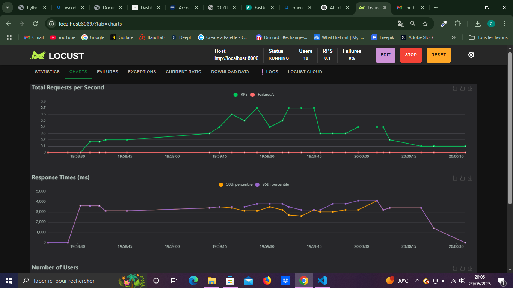

# Projet de méthodologie de test

## 🗂️ Architecture du projet

```
projet/
├── src/
│   ├── services/
│   ├── tests/
│   └── .env
```

Le fichier `.env` contient les clés d’API nécessaires au bon fonctionnement de l’application :

```
weather_api_key = "..."
ninja_api_key   = "..."
```

- `weather_api_key` : clé à obtenir sur [WeatherAPI](https://www.weatherapi.com)
- `ninja_api_key` : clé à obtenir sur [API Ninja](https://api-ninjas.com)

> 📌 Vous devez créer un compte sur chaque plateforme pour récupérer votre clé d’API.

---

## 📦 Dépendances

Installez les bibliothèques nécessaires via le fichier `requirements.txt` :

```bash
pip install -r requirements.txt
```

---

## 🚀 Lancer l’application

Depuis le dossier `services/`, ou en spécifiant son chemin :

```bash
fastapi run app.py
```

- L'API démarre sur le port `8000`
- La documentation interactive est accessible ici : [http://localhost:8000/docs](http://localhost:8000/docs)

---

## 🌐 Routes disponibles

| Endpoint                         | Description                                                               |
|----------------------------------|---------------------------------------------------------------------------|
| `/`                              | Message de bienvenue                                                      |
| `/health`                        | Vérifie que l’API est opérationnelle                                      |
| `/geocoding/{city}`              | Renvoie la latitude et la longitude de la ville                           |
| `/weather/current/{city}`        | Donne la température actuelle de la ville                                 |
| `/weather/forecast/{city}`       | Fournit les prévisions horaires de température pour aujourd’hui (24h)     |
| `/weather/history/{city}`        | Donne les températures horaires d’hier pour la ville (24h)                |

> 📌 Les températures sont moyennées entre deux sources si disponibles. Si une seule source est présente, cela signifie que l’autre est momentanément indisponible.

---

## ✅ Tests

### 🧪 Tests unitaires

Les tests sont situés dans le dossier `tests/`. Pour les exécuter :

```bash
pytest
```

---

### 📈 Tests de charge

Les tests de charge sont basés sur **Locust** et se trouvent dans `tests/load/`.  
Exécutez-les avec la commande suivante :

```bash
locust -f test_locust.py --users 10 --spawn-rate 0.2 --host http://localhost:8000
```

Cela ouvrira une interface graphique sur [http://localhost:8089](http://localhost:8089).

> ⚠️ Évitez d’augmenter brusquement le nombre d’utilisateurs pour ne pas vous faire bannir par les API externes.

📎 Des captures d’écran ainsi qu’un rapport des tests réalisés sont disponibles dans `tests/load/`.


